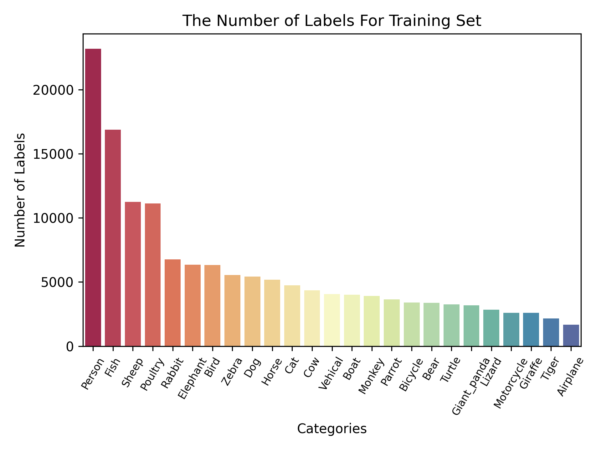
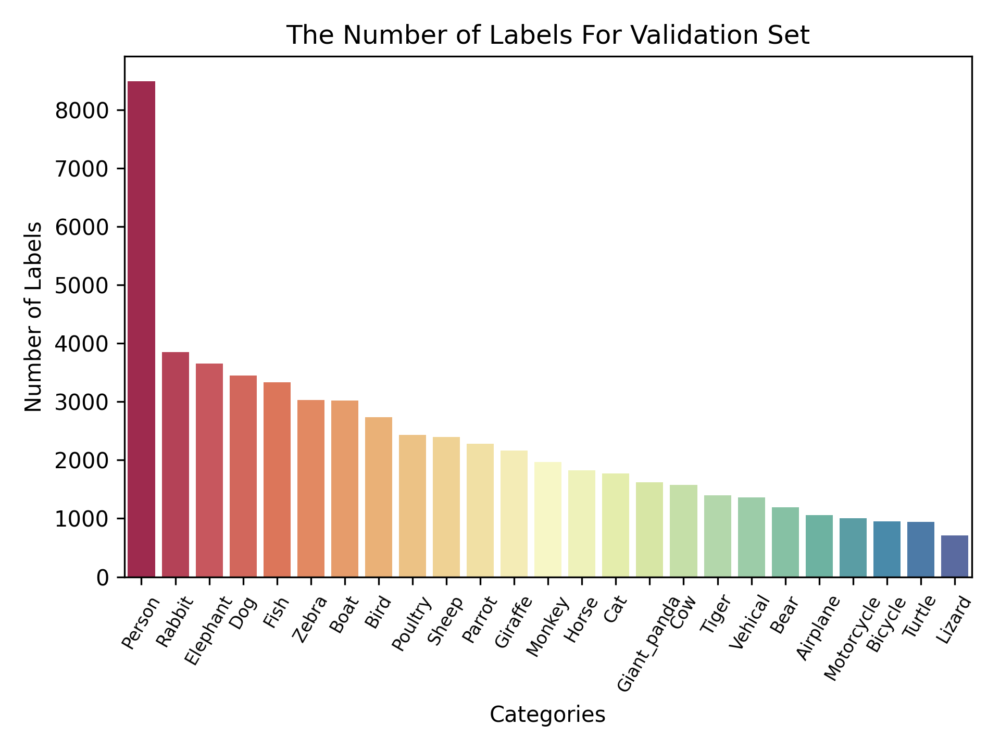
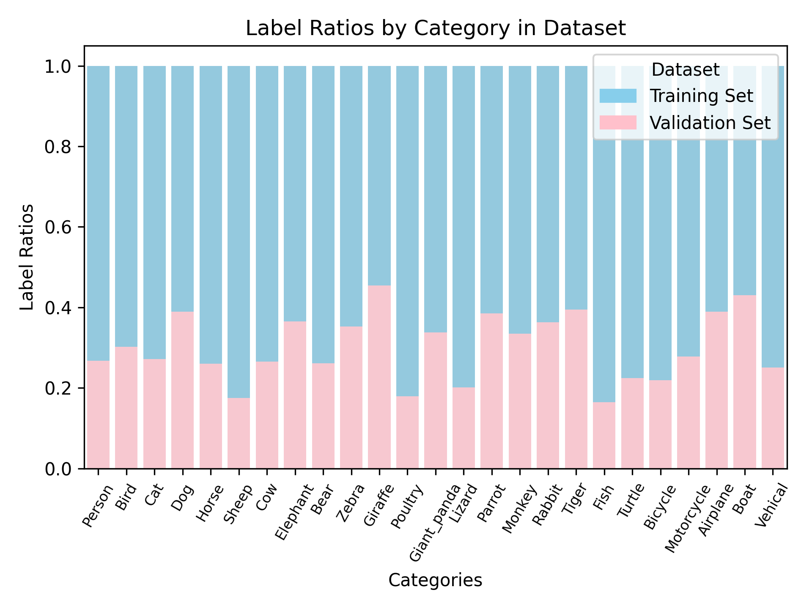
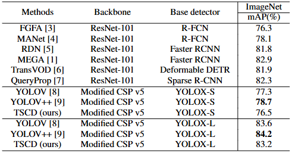
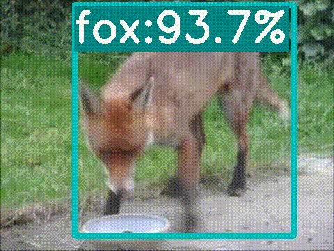
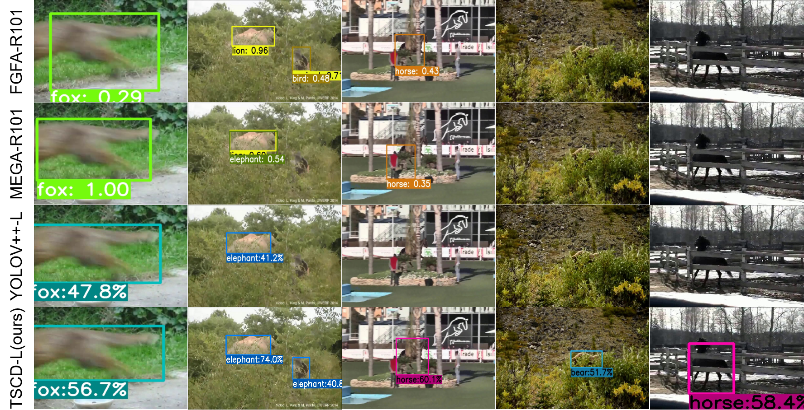
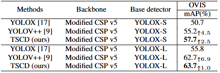
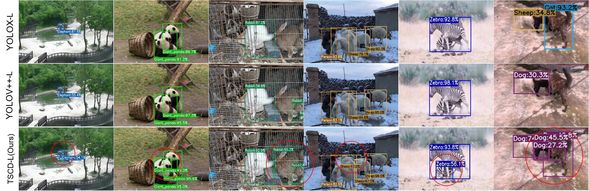

# Task-Specific SpatioTemporal Context-Aware Decoupling for Occluded Video Object Detection. (This GitHub account doesn't reveal any information about the author, sticking to the principle of double-blind.)


## Introduction

**Task-Specific SpatioTemporal Context-Aware Decoupling for Occluded Video Object Detection(TSCD)** is a video object detector for occlusion, which adapts the global semantic information and local localization information needed for classification and regression tasks, respectively. Furthermore, a spatiotemporal context-aware feature matching (CAFM) module is utilized to refine the regression features while avoiding inter-frame feature mixing. Effective object associations are used to improve the regression of occluded object locations.

This repo is an implementation of PyTorch version TSCD based on YOLOV and YOLOX.


## Quick Start

<details>
<summary>Installation</summary>

Install TSCD from source.
```shell
git clone git@github.com:Video-Object-Detection/TSCD.git
cd TSCD
```

Create conda env.
```shell
conda create -n tscd python=3.8.19

conda activate tscd

pip install -r requirements.txt

pip3 install -v -e .
```
</details>


<details>
<summary>Reproduce our results on OVIS</summary>

OVIS is used to validate the effect of detecting occluded objects.The training set consists of 607 videos. Because only the annotation of the training set is publicly available, the original OVIS training set was partitioned into training and validation sets with an approximate ratio of 7:3 for each category.


| The Number of Training Labels                                                                   | The Number of Validation Labels                                                            |
|-------------------------------------------------------------------------------------------------|--------------------------------------------------------------------------------------------|
|  |  |
<p align="center">Table 1. Number of labels for each category in the training and validation sets.</p>

[//]: # (![The Number of Training Labels]&#40;ovis_pre-process/division/datasets_visual/Training_Labels.png&#41;)

[//]: # (<div style="text-align: center;">Fig 1. Number of labels for each category in the training set.</div>)

[//]: # ()
[//]: # (![The Number of Validation Labels]&#40;ovis_pre-process/division/datasets_visual/Validation_Labels.png&#41;)

[//]: # (<div style="text-align: center;">Fig 2. Number of labels for each category in the validation set.</div>)


<p align="center">Fig 1. Ratio of labels for each category in the training and validation sets</p>

Step 1. Download the OVIS dataset from [OVIS official website] and organize it as follows:
```shell
path to your datasets/ovis
```

Step 2. Divide the training and validation sets yourself and convert the OVIS COCO format annotations for video object detection. (Download the [annotations] of the divided training and validation sets for video object detection directly. Then, put them in datasets/ovis/annotations.)
```shell
python OVIS_Preprocess/division/ovis_train_valid_data_division.py
-o path to your datasets/ovis/annotaions/annotations_train.json
-t path to your datasets/ovis/annotaions/annotations_train_new.json
-v path to your datasets/ovis/annotaions/annotations_valid_new.json
-ratio 0.7

python yolox/data/datasets/ovis.py
--ovis_train path to your datasets/ovis/annotaions/annotations_train_new.json 
--ovis_valid path to your datasets/ovis/annotaions/annotations_valid_new.json
--vid_train path to your datasets/ovis/annotaions/ovis_train_vid.json
--vid_valid path to your datasets/ovis/annotaions/ovis_valid_vid.json
```

Step 3. Change the "data_dir" field in [exp files](exps/TSCD_OVIS) to [path to your datasets] and download our [weights].

**Training:**
1. The baseline YOLOX detector was initialized with COCO-pretrained weights from the [YOLOX official repository] and fine-tuned on the OVIS dataset.
```shell
python tools/train.py -f exps/ovis_default/ovis_yolox_l.py -c [yolox_l pretrained weights on COCO] -b [batch size] -d [your devices] --fp16
```

2. Initialize the TSCD with finetuned weights obtained by the up step.

```shell
python tools/tscd_train.py -f exps/TSCD_OVIS/ovis_tscd_large.py -c [path to your weights] --fp16
```

**Evaluation:**
```shell
python tools/tscd_eval.py -f exps/TSCD_OVIS/ovis_tscd_large.py -c path to your weights/ovis_tscd_large.pth --dataset ovis --fp16
```

**Visualization:**
```shell
python tools/tscd_demo.py -f exps/TSCD_OVIS/ovis_tscd_large.py -c [path to your weights]/ovis_tscd_large.pth --dataset ovis --path [path to your video] --conf 0.25 --nms 0.5 --tsize 576 --save_result True
```
(For yolox models, please use python tools/demo.py for inference.)
</details>


<details>
<summary>Reproduce our results on VID</summary>

Step 1. Download datasets and weights:

Download ILSVRC2015 DET and ILSVRC2015 VID dataset from [IMAGENET offical website] and organise them as follows:

```shell
path to your datasets/ILSVRC2015/
path to your datasets/ILSVRC/
```

Download COCO-style [annotations] for training, FGFA version training [annotation] and [training/validation video sequences]. Then, put them in these two directories:
```shell
./annotations/vid_train_coco.json
./annotations/ILSVRC_FGFA_COCO.json
./yolox/data/dataset/train_seq.npy
./yolox/data/dataset/val_seq.npy
```

Change the data_dir in exp files to [path to your datasets] and Download our weights.

Step 2. Generate predictions and convert them to IMDB style for evaluation.

```shell
python tools/val_to_imdb.py -f exps/TSCD_VID/vid_tscd_large.py -c path to your weights/vid_tscd_large.pth --fp16 --output_dir ./vid_tscd_large.pkl
```
**Evaluation:**
```shell
python tools/REPPM.py --repp_cfg ./tools/yolo_repp_cfg.json --predictions_file ./vid_tscd_large.pkl --evaluate --annotations_filename ./annotations/annotations_val_ILSVRC.txt --path_dataset [path to your dataset] --store_imdb --store_coco  (--post)
```
(--post) indicates involving post-processing method. Then you will get:
```shell
{'mAP_total': 0.8321641538770728, 'mAP_slow': 0.8739477281753849, 'mAP_medium': 0.8211214638886932, 'mAP_fast': 0.67491957769612891}
```

**Training:**
```shell
python tools/tscd_train.py -f exps/TSCD_VID/vid_tscd_large.py -c weights/yoloxl_vid.pth --fp16
```

**Roughly Evaluation:**
```shell
python tools/tscd_eval.py -f exps/TSCD_VID/vid_tscd_large.py -c weights/tscd_large.pth --tnum 500 --dataset vid --fp16
```
tnum indicates testing sequence number.

**Visualization:**
```shell
python tools/tscd_demo.py -f exps/TSCD_VID/VID_tscd_large.py -c [path to your weights]/vid_tscd_large.pth --path [path to your video] --dataset vid --conf 0.25 --nms 0.5 --tsize 576 --save_result True
```
(For yolox models, please use python tools/demo.py for inference.）
</details>


## Main Results


<div style="text-align: center; "><strong>ImageNet VID</strong></div>


<div align="center">
  
  <p align="center">Table. 2. Performance comparison with SOTA end-to-end video object detections on the ImageNet VID validation set.</p>
</div>

<div align="center">

  

  

  

</div>

[//]: # (<div style="display: flex; justify-content: space-between;">)

[//]: # ()
[//]: # ( )

[//]: # ()
[//]: # ( )

[//]: # ()
[//]: # ( )

[//]: # ()
[//]: # (</div>)


<p align="center">Video. 1. Video visualization of TSCD detection in ImageNet VID occlusion scenes</p>

<div align="center">

  

  <p align="center">Fig. 2. Visual comparison of competing models on the ImageNet VID dataset.</p>

</div>

<br/>

<div style="text-align: center; "><strong>OVIS</strong></div>


<div align="center">
  
  <p align="center">Table. 3. Performance comparison on OVIS validation set.</p>
</div>

<div align="center">

  

  

  

</div>

[//]: # (<div style="display: flex; justify-content: space-between;">)

[//]: # ()
[//]: # ( )

[//]: # ()
[//]: # ( )

[//]: # ()
[//]: # ( )

[//]: # ()
[//]: # (</div>)

<p align="center">Video. 2. Video visualization of TSCD detection in OVIS occlusion scenes</p>

<div align="center">

  

  <p align="center">Fig. 3. Visual comparison of related methods on the OVIS dataset.</p>

</div>


## Acknowledgements

* [YOLOV]
* [YOLOX]
* [Robust-and-efficient-post-processing-for-video-object-detection]


